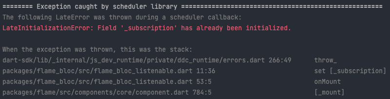

# bug_demo_1

A new Flutter project.

## Getting Started

A small, simplistic Flutter Flame application to demonstrate possible bug.

## Situation

The situation arises when using the Flame Router and FlameBloc's FlameBlocListenable mixin
on a component that is a child of a Route.

In this quick demo app, there is a Bloc (called DemoBloc) to supply some game state.  
The router is provided as a child to the FlameBlocProvider so that the bloc is availalbe
to all components down the tree.

The router has three Routes defined:

- main_menu - a simple menu with two buttons to visit route1 and route2
- route1 - Some buttons to increment and decrements two counters in the bloc.  Also a button to pop the route back to main_menu
- route2 - Just two text fields to display the counts in the bloc and a button to pop the route back to main_menu

## Creating The Problem

After visiting a Route containing a component that uses FlameBlocListenable and popping that route, 
if the same route is visited again, a LateInitializationError occurs when the onMount method of the 
mixin sets the _subscription variable.

- Run the Flutter app
- Click to visit route 1
- Click exit button to pop back to main_menu route
- Click to visit route 1 again
- Problem happens:
- 

It does not matter how far down the component tree the FlameBlocListenable is used.  In this demo,
route2 has two text fields child components that use the mixin and the same issue happens.

- Run the Flutter app
- Click the visit route 2
- Click exit button to pop back to main_menu route
- Click to visit route 2 again
- Same Problem.

## Cause of Problem

When a route it popped from the route stack, it is removed from the component tree but the route
object continues to live because the router component continues to hold a reference to it.
Therefore, when the previously visited route is visited again, the `late final StreamSubscription _subscription`
field in FlameBlocListenable cannot be set again because the component remained alive.

## Possible Solution

A solution I have tried is to change `_subscription` in FlameBlocListenable to not be
a final field.  On the subsequent mount of the component, the subscription is initialized without error.
This seems ok to me since when the component was removed from the component tree the previous 
subscription was cancelled.

## On a related note

I realized that if the Route did not keep it's child component alive, this problem would not 
happen either.  I will submit a feature request for this separately, because I realize there are
valid use cases for wanting to keep the route's child component alive so that it is in the same
state upon revisit as it was when it was popped.  But in my current game, I would like for the
downstream component tree to be recreated when revisiting the route.

